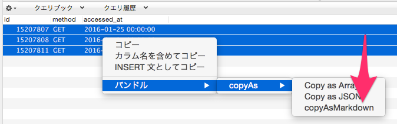

# Markdown Output and Copier For Sequel Pro Bundle [](https://travis-ci.org/hypermkt/CopyAsMarkdownForSequelProBundle)

Copy selected rows as Markdown. It's so easy to paste in GitHub issue.

## Requirement
* [Sequel Pro](http://www.sequelpro.com/)
* >= PHP5.6

## Installation
1. Clone this. `git clone git@github.com:hypermkt/CopyAsMarkdownForSequelProBundle.git`
1. Double-Click `copyAsMarkdown.spBundle`.

## Usage
1. Right-Click on selected rows.
1. Select `Bundle > copyAs > copyAsMarkdown`.
1. Paste it!

### Click!


### Paste!
```
id|method|accessed_at
---|---|---
15207807|GET|2016-01-25 00:00:00
15207808|GET|2016-01-25 00:00:00
15207811|GET|2016-01-25 00:00:01
```

## License

This software is released under the MIT License, see LICENSE.txt.
